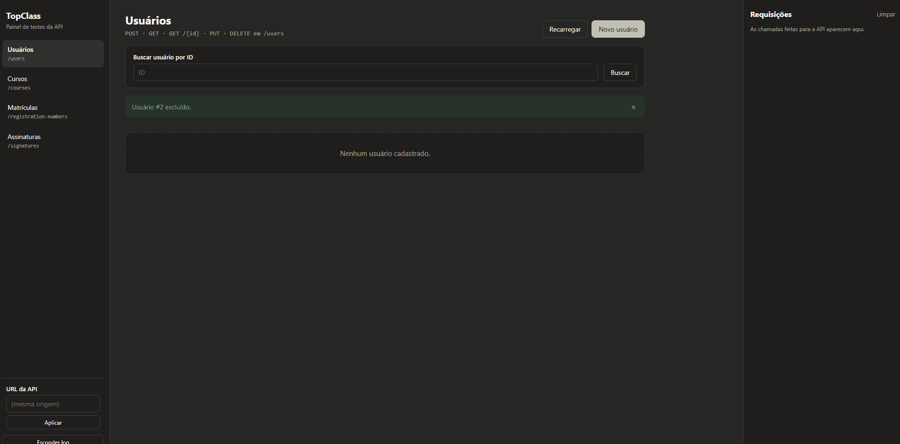

# TopClass — Prática ATDD (Grupo 1)



API REST em Spring Boot de uma plataforma de cursos online, desenvolvida com **ATDD** (histórias de usuário → cenários BDD → testes TDD), e um front em React para testar todos os endpoints.

Regra principal (US #1): ao concluir um curso com nota **≥ 7**, ele conta para a assinatura do aluno; ao chegar em **12 cursos**, o plano é promovido automaticamente de `BASIC` para `PREMIUM`, e a promoção não é aplicada de novo.

## Tecnologias

- **Backend:** Java 21, Spring Boot 4.1, Spring Data JPA, Spring Security, springdoc-openapi (Swagger)
- **Banco:** PostgreSQL 16 (Docker) e H2 em memória (execução local e testes)
- **Testes:** JUnit 5, Mockito, MockMvc e JaCoCo (cobertura)
- **Frontend:** React 19 + Vite

## Grupo
Nathan Tanzi\
Amanda Soares\
Marisol Marques\
Giulia Albuquerque


## ATDD — Tabela do projeto (`ATDD.xlsx`)

### Product Backlog — User Stories

| # | Pessoa | Como (As a) | Quero (I want) | Para (so that) |
|---|---|---|---|---|
| 1 | (Nathan) ALUNO | COMO Aluno da plataforma de cursos online | QUERO que meu plano seja promovido automaticamente para Premium ao conquistar 12 cursos | PARA ter acesso a benefícios exclusivos sem precisar solicitar manualmente. |
|  | (Amanda)ALUNO | COMO Aluno com plano Premium | QUERO receber vouchers para participar de projetos reais durante os cursos | PARA aplicar o conhecimento adquirido em cenários práticos e enriquecer meu portfólio. |
|  | (Giulia) ALUNO | COMO Aluno com plano Premium | QUERO receber 3 moedas ao atingir o plano Premium | PARA poder convertê-las em novos cursos, acumulá-las ou resgatá-las como criptomoeda. |
|  | (Marisol) ALUNO | COMO Aluno com plano Premium que possui moedas | QUERO poder escolher como utilizar minhas moedas (conhecimento, acúmulo ou criptomoeda) | PARA ter autonomia sobre minhas recompensas e personalizar minha experiência na plataforma. |

### Sprint Backlog — BDD (cenários / critérios de aceite)

| Pessoa | Dado (Given) | E (And) | Quando (When) | E (And) | Então (Then) | E (And) |
|---|---|---|---|---|---|---|
| (Nathan) ALUNO | Dado um aluno com 11 cursos com conquistados | E com plano básico ativo | Quando o aluno conquista o 12º curso | — | Então o plano do aluno deve ser atualizado para "Premium" | — |
| (Amanda)ALUNO | Dado um aluno com menos de 12 cursos conquistados | — | Quando o sistema verifica o plano do aluno | — | Então o plano deve permanecer como básico | — |
| (Giulia) ALUNO | Dado um aluno que já possui plano Premiun | E já conquistou 12 cursos anteriormente | Quando o aluno conquista mais um curso | — | Então o plano deve continuar Premium | E a promoção não deve ser aplicada novamente |
| (Marisol) ALUNO | Dado um aluno que teve o plano atualizado automaticamente para Premium | — | Quando o aluno acessa a área de benefícios exclusivos da plataforma | — | Então o sistema deve conceder acesso completo aos benefícios, sem exigir qualquer solicitação manual | — |

### Sprint — Implementação (TDD)

| Pessoa | Cenário (Scenario) | Execução (Execution) | Resultado (Asserts) |
|---|---|---|---|
| (Nathan) ALUNO | <code>@Test<br>public void devePromoverParaPremiumAoConquistarDecimoSegundoCurso() {<br>var aluno = new Aluno("Nathan", 11, "basico");<br>}</code> | <code>aluno.conquistarCurso();</code> | <code>assertEquals("premium", aluno.getPlano());</code> |
| (Amanda)ALUNO | <code>@Test<br>public void deveManterPlanoBasicoComMenosDe12Cursos() {<br>var aluno = new Aluno("Nathan", 10, "basico");<br>}</code> | <code>aluno.conquistarCurso();</code> | <code>assertEquals("premium", aluno.getPlano());</code> |
| (Giulia) ALUNO | <code>@Test<br>public void deveLiberarBeneficiosAutomaticamenteAoTornarSePremium() {<br>var aluno = new Aluno("Nathan", 11, "basico");<br>}</code> | <code>aluno.conquistarCurso();</code> | <code>assertTrue(aluno.beneficiosLiberadosSemSolicitacao());</code> |
| (Marisol) ALUNO | <code>@Test<br>public void naoDeveLiberarBeneficiosSemAtingirPremium() {<br>var aluno = new Aluno("Nathan", 10, "basico");<br>}</code> | <code>aluno.conquistarCurso();</code> | <code>assertFalse(aluno.beneficiosLiberadosSemSolicitacao());</code> |

## Como rodar

### Tudo com Docker

```bash
docker compose up --build
```

- App (API + front): http://localhost:9090
- Swagger: http://localhost:9090/docs
- pgAdmin: http://localhost:5050 (admin@admin.com / admin)

### Backend local

```bash
./mvnw spring-boot:run
```

A API sobe em http://localhost:8080 (Swagger em `/docs`).

### Frontend local

```bash
cd frontend
npm install
npm run dev
```

Abre em http://localhost:5173 e chama a API em `http://localhost:8080`. A URL pode ser trocada na barra lateral.

### Testes e cobertura

```bash
./mvnw clean test
```

O relatório do JaCoCo fica em `target/site/jacoco/index.html`.

## Endpoints

| Recurso | Métodos |
|---|---|
| `/users` | `POST`, `GET`, `GET /{id}`, `PUT /{id}`, `DELETE /{id}` |
| `/courses` | `POST`, `GET`, `GET /{id}`, `PUT /{id}`, `DELETE /{id}` |
| `/signatures` | `GET`, `GET /{id}`, `PUT /{id}`, `DELETE /{id}` |
| `/registration-numbers` | `POST`, `GET /{id}`, `PATCH /{id}/conclude` |

## Estrutura

```
src/main/java/.../
  controller/   endpoints REST e tratamento de erros
  domain/       entidades (User, Course, Signature, RegistrationNumber) e value objects
  dto/          objetos de request/response
  service/      regras de negócio
  repository/   Spring Data JPA
frontend/       painel React para testar a API
evidencias/     evidências das fases RED, GREEN e BLUE
ATDD.xlsx       planilha de user stories, BDD e TDD
```
